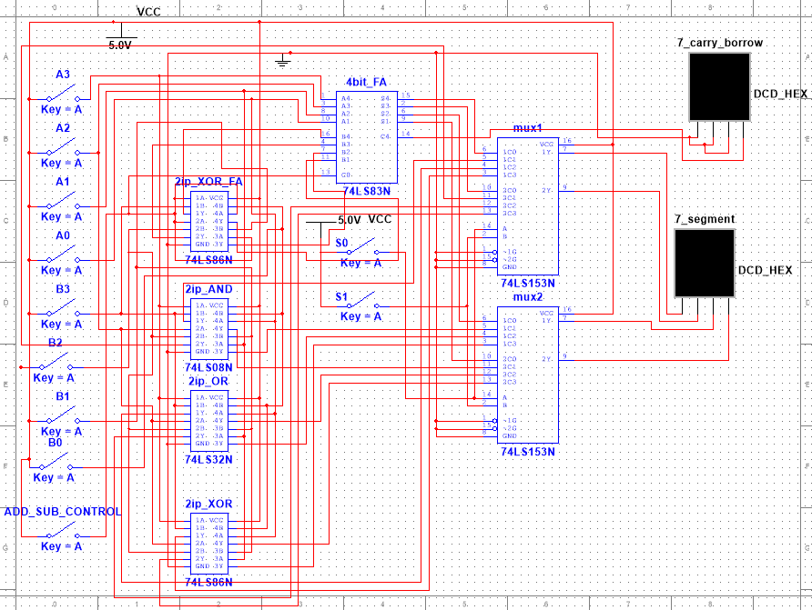

# 4-Bit Arithmetic Logic Unit (ALU) in NI Multisim

## Project Overview
This project is a simulation of a **4-bit ALU (Arithmetic Logic Unit)** designed using **NI Multisim**. It is capable of performing both arithmetic (Addition, Subtraction) and logical operations (AND, OR, XOR) on two 4-bit binary numbers.

The design uses standard **74LS series TTL ICs** and features a **Multiplexer-based selection system** to display the output on a single 7-segment display.

## Features
- **4-Bit Inputs:** Accepts two 4-bit binary numbers (A and B) via DIP switches.
- **Arithmetic Unit:** Performs Addition and 2's Complement Subtraction.
- **Logic Unit:** Performs bitwise AND, OR, and XOR operations.
- **Output Selection:** Uses a 4-to-1 Multiplexer to select which operation is displayed.
- **Visualization:** Output is decoded and shown on a Hexadecimal 7-Segment Display.

## Components Used
| Component | Quantity | Description |
|-----------|:--------:|-------------|
| **74LS83N** | 1 | 4-Bit Binary Full Adder |
| **74LS153N** | 2 | Dual 4-to-1 Multiplexer (Data Selector) |
| **74LS86N** | 2 | Quad 2-Input XOR Gate (used for Subtraction logic & Logic XOR) |
| **74LS08N** | 1 | Quad 2-Input AND Gate |
| **74LS32N** | 1 | Quad 2-Input OR Gate |
| **DCD_HEX** | 2 | Decoded 7-Segment Hex Display |
| **Switches** | 10 | For Inputs A, B, and Select Lines |

## Operation Logic
The ALU operation is controlled by the **Select Switches (S1, S0)** and the **Mode Switch (M)**.

### **Selection Truth Table**
| S1 | S0 | Selected Operation | Description |
|:--:|:--:|-------------------|-------------|
| 0 | 0 | **Arithmetic** | Performs A + B (if M=0) or A - B (if M=1) |
| 0 | 1 | **Logic AND** | Performs A & B (Bitwise AND) |
| 1 | 0 | **Logic OR** | Performs A \| B (Bitwise OR) |
| 1 | 1 | **Logic XOR** | Performs A ⊕ B (Bitwise XOR) |

### **Arithmetic Mode Details**
- **Addition:** Set `M = 0`. The 74LS83 adds A + B.
- **Subtraction:** Set `M = 1`. The circuit uses **2's Complement Logic**:
  - The B input is inverted using XOR gates.
  - A `+1` is added via the Carry-In (C0) pin of the Adder.
  - Result: $A + \bar{B} + 1$.

